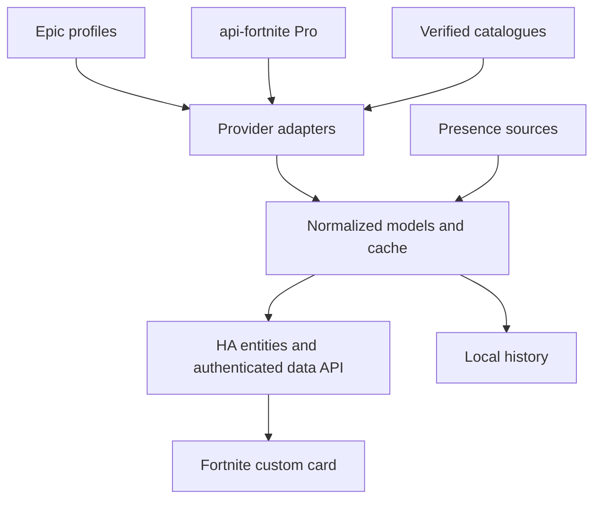

# Fortnite Family Tracker — investigation and implementation handoff

Prepared for the project owner and a local coding agent. Evidence snapshot: 14 September 2026. Version 1.0.

## 1. Read this first

Build an automatic Fortnite tracker for Player One and his son Player Two, running continuously at home and displayed in Home Assistant. First resolve the remaining data-access questions with small, reproducible probes; then implement the verified features. This is an engineering handoff, not a claim that every proposed feature already works.

The project has successfully obtained personal Epic profile data, public statistics, ranked tracks, and sprite collection data. The largest gaps are readable quest definitions, a complete current Battle Pass reward catalogue, reliable cross-platform presence, and automatic tournament broadcast discovery. These gaps must remain visible in the capability model and must not block the usable core indefinitely.

Use the following evidence vocabulary in code notes and research reports:

- **Observed:** an actual response supplied during this investigation supports it.
- **Documented:** a provider advertises or documents it; a successful response has not yet been established here.
- **Proposed:** a design choice to implement or refine.
- **Unverified:** a hypothesis requiring a live test.

Do not ask Player One to repeat setup already completed. Inspect the local repository, supplied fixtures, and locally configured credentials first. Perform authorized research and local development autonomously. Ask only for genuinely unavailable inputs, such as Player Two's Epic identity or an interactive Epic sign-in. Never invent credentials, platform mappings, eligibility, quest targets, or reward totals.

Do not purchase another subscription, publish data, send support messages, change Epic account settings, or deploy into the household's live HA installation without corresponding authorization. Local development, read-only probes, synthetic tests, and preparing installation artifacts are part of this task.

## 2. Product brief and fixed preferences

### People and platforms

| Person | Epic identity | Platforms | Notes |
| --- | --- | --- | --- |
| Player One | `ExamplePlayer`; Epic ID `{expected_player1_account_id}` | PC only for Fortnite | Mostly ranked now; display name may change, so key storage by Epic ID |
| Player Two | Not yet supplied | Mostly Nintendo Switch; PS5 intended as secondary/next platform | His PS5 account and Epic link have not yet been set up |

Player One says Player Two is on his Epic friends list. Resolve the correct friend, but do not guess which friend is Player Two from an arbitrary display name. Track each player's private data through that player's own authorization. Player Two's console migration must not create a duplicate player when his Epic ID stays the same.

### Desired coverage

- Battle Royale Build, Battle Royale Zero Build, and Reload; ranked and unranked wherever evidence supports separation.
- Stats, ranks, trends and improvement for both players.
- Battle Pass level, rewards claimed, rewards remaining, and future/time-gated rewards when identifiable.
- Personal quest progress, free cosmetics and expiry reminders, all automatic.
- Sprite collection: owned/missing variants, mastery and completion.
- Upcoming tournaments they might enter, requirements and rewards.
- Worldwide major tournaments to watch, especially FNCS and streamed prize-money events, with English broadcasts.
- Embedded official YouTube broadcasts when feasible; otherwise a clear YouTube link.
- A current-session view while someone is playing, combining presence and newly available statistics. Live match telemetry is a stretch goal, not established functionality.

### User experience and operational constraints

- Primary displays: an office wall tablet while playing, a PC browser/second screen, and a shared household dashboard. Fire HD 10 landscape is a useful performance reference; do not assume one fixed resolution.
- Use English. Store timestamps in UTC and display in `Europe/London`, including BST/GMT changes.
- No manual completion checkboxes or routine progress entry. One-time account linking/configuration is acceptable.
- Minimize maintenance and reauthentication. No routine PC interaction.
- Avoid requiring a gaming-PC agent. User is wary of anti-cheat interference and a PC-only solution excludes Player Two.
- No game memory access, injection, input automation, or packet interception. Ordinary authenticated web requests and documented client protocols are the intended approach.
- An initial free-API preference has evolved: Player One has now paid for **api-fortnite.com Pro**. Do not assume he wants more subscriptions.
- The user is a designer and wants a polished visual tracker, but reliable data is more important than presenting unsupported detail.

## 3. Target environment

User supplied this HA environment, dated 14 September 2026:

| Field | Value |
| --- | --- |
| Installation | Home Assistant OS on an old Windows workstation, now running HA OS |
| Core | `2026.9.2` |
| Supervisor | Enabled |
| Docker | Present as part of HA OS |
| Architecture | `amd64` / `x86_64` |
| Python | `3.14.6` reported by HA |
| OS kernel | `6.18.39-haos` |
| Configuration | `/config` |
| Timezone | `Europe/London` |

Development access currently originates from a MacBook. Give macOS-compatible bootstrap commands. Do not assume the Mac's system Python matches HA or that running Python 3.14 on macOS constitutes HA compatibility testing. Use an appropriate isolated environment/container for HA integration tests.

Do not treat HA OS as a general-purpose Docker host or install arbitrary packages in HA Core's running container. Package work as a custom integration, custom card, and, only if justified, a supported Supervisor add-on/app.

### Existing presence integrations

PS5 MQTT and the PSN integration are installed. Known entities:

```text
binary_sensor.ps5_mqtt_running
sensor.ps5_mqtt_cpu_percent
sensor.ps5_mqtt_memory_percent
sensor.ps5_mqtt_newest_version
update.ps5_mqtt_update
sensor.examplepsn_now_playing
sensor.examplepsn_online_status
sensor.examplepsn_last_online
sensor.examplepsn_online_id
image.examplepsn_now_playing
```

`ExamplePSN_` is **Player One's PSN account**, not Player Two's. The listed PS5 MQTT running/CPU/memory entities describe the service, not Fortnite activity or console power. The observed PSN snapshot was offline with now-playing unknown. No Nintendo integration or Player Two presence mapping is verified. Do not attach Player One's PSN entities to Player Two or infer that Player One is playing on PC because his PSN account is online.

## 4. Evidence register and limitations

These values describe snapshots, not current live truth. Preserve response timestamps and retrieve fresh data during development.

### 4.1 Confirmed public and ranked data

`fortnite-api.com` returned HTTP 200 for ExamplePlayer. The supplied response included Battle Pass level 201/progress 46 and aggregate stats: 415 matches, 61 wins, 1,448 kills, KD 4.09, 14.699% win rate. It grouped stats under `all` and `keyboardMouse`, with `overall`, `duo`, `squad`, and `ltm` buckets. The exact period/request arguments must be recovered from local evidence or recorded on a fresh request; do not label a snapshot lifetime/current-season by assumption.

Input grouping is not platform grouping. `keyboardMouse` does not identify a unique PC account. `ltm` is not safely equivalent to Reload or Zero Build. Do not sum overlapping overall and submode aggregates.

Prior investigation recorded api-fortnite.com's `/api/v2/stats/{accountId}` returning 954 playlist-keyed fields. Treat this as evidence that finer stats exist, not proof of a completed semantic mapping. Reinspect the original fixture and validate Build/Zero Build/Reload/ranked mappings before shipping mode filters.

`/api/v1/profile/ranked` worked after the Pro upgrade. The investigation recorded current BR Champion I at 8%, Reload Build Elite III at 5%, and an Arena Boxfights track; historical tracks were also present. These are historical test results. Use track identifiers, season dates and `isCurrent` metadata, and validate division/progress semantics against the game. Do not infer conventional rank naming from a numeric index without testing.

### 4.2 Authentication

api-fortnite.com device OAuth flow completed successfully:

1. `GET /api/v1/oauth/get-token` returned a flow ID and an Epic verification URL.
2. User completed the browser sign-in.
3. `POST /api/v1/oauth/complete` returned an access token, refresh token, account ID and device-auth credentials.
4. Observed access-token lifetime: 7,200 seconds.

The documentation exposes refresh-token and device-auth refresh routes. **Long-running silent renewal, rotation, restart recovery, and two simultaneous linked accounts have not yet been proven.** Device-auth availability makes hands-off operation plausible, not guaranteed.

Credentials are intentionally absent from this handoff. A provider API key and a player's Epic token are different credentials: provider requests use `x-api-key`; private provider requests additionally use `x-fortnite-token`; direct Epic profile calls use `Authorization: Bearer <Epic access token>`. Confirm exact request bodies against current OpenAPI instead of guessing field spelling.

### 4.3 Provider failures and misleading responses

| Request | Observed result | Interpretation |
| --- | --- | --- |
| `/api/v2/quests/{accountId}` | Upstream 401 repeatedly | Private quest wrapper failed; not proof that the account lacks quests |
| `/api/v2/fn/br-inventory/{accountId}` | `{"stash":{"globalcash":0}}` | Response is insufficient to represent cosmetic locker ownership |
| `/api/v2/fn/entitlement` | Upstream 404 in prior investigation | Do not interpret as no entitlements |
| `/api/v1/profile/level` | HTTP 200; level/tier 202, XP 61,693, account level 3,244, `purchased:false` | Level works; ownership flag disagrees with raw Crew/pass evidence |
| `/api/v1/crew/current` | Successful public pack data | Describes Crew content, not this player's subscription status |
| `/api/v2/battlepass` | 404, `No battle pass has been extracted yet` | Catalogue unavailable in the tested response |
| `/api/v2/battlepass/seasons` | HTTP 200 with empty `data` | No archived seasons reported by that catalogue endpoint |
| `/api/v1/shop/battlepass` | Swagger says it actually returns BR news/MOTD | Do not use this as a reward catalogue just because of its name |

A valid token successfully reading one endpoint does not prove every failing endpoint uses the same upstream service/client permissions. Classify the failing upstream request before refreshing credentials repeatedly. The quest failure is consistent with a wrapper/routing/auth-context issue, but its precise cause has not been established.

### 4.4 Raw Epic profile succeeds

Observed successful read-only QueryProfile call:

```http
POST https://fortnite-public-service-prod11.ol.epicgames.com/fortnite/api/game/v2/profile/{accountId}/client/QueryProfile?profileId=athena&rvn=-1
Authorization: Bearer <Epic access token>
Content-Type: application/json

{}
```

Repeat with `profileId=common_core` for the subscription data. This uses a game backend, not a promised stable public developer API; isolate it behind an adapter. QueryProfile uses POST but is the read operation used in this investigation. Never substitute account-changing profile commands.

The `athena` fixture's full profile was updated on `2026-09-13T21:59:00.467Z`, version beginning `season42_4210`. It contains 4,022 items, including:

| Template type | Count in snapshot |
| --- | ---: |
| Quest | 645 |
| ChallengeBundle | 100 |
| AthenaCharacter | 278 |
| AthenaBackpack | 337 |
| AthenaPickaxe | 247 |
| AthenaGlider | 203 |
| AthenaDance | 808 |
| AthenaItemWrap | 178 |
| AthenaLoadingScreen | 413 |
| AthenaSkyDiveContrail | 122 |
| AthenaMusicPack | 63 |

These are profile item counts, not a guaranteed count of unique user-visible skins/emotes/styles. Variant ownership and template semantics must be parsed separately. In particular, the dance category may cover multiple cosmetic subtypes.

Quest states: 500 Active and 145 Claimed. 198 quest records have `completion_...` fields; 137 active records have a counter or expiry. These are backend records across different content types, not 500 currently playable BR quests. Some entries are internal grant/control quests, hidden, stale, locked or outside the requested modes. Do not show this count as the dashboard's available quest count.

Example observed record:

```json
{
  "templateId": "Quest:quest_s42_weekly_w03_q01",
  "attributes": {
    "quest_state": "Claimed",
    "completion_quest_s42_weekly_w03_q01_obj0": 500,
    "last_state_change_time": "2026-09-03T16:37:37.452Z"
  }
}
```

The value 500 is an observed counter, not independently verified objective target text. Do not derive target values from one completed player's counter. Challenge bundles link quest instance IDs and carry some bundle counters; they do not by themselves supply complete English descriptions or all gameplay prerequisites.

### 4.5 Battle Pass ownership and claims

Observed `AthenaSeason:athenaseason42` attributes include:

- `purchased: true` and subscription purchase-context history.
- A recorded Subscription purchase on 22 August at level 22.
- `level: 200` on the season item, while top-level profile/book level is 202. Preserve this discrepancy; use a named field mapping rather than blindly choosing the largest number.
- `currency_season_total: 199`; its exact meaning should be verified before displaying a spendable currency balance.
- 147 `purchased_offers`: 44 free and 103 premium in the previous analysis, containing 160 loot results.

Claimed offers are not the same as 147 unique cosmetics, and 160 loot results are not necessarily 160 distinct visual rewards. Styles, currencies, quantities and repeated templates need explicit handling.

Player One states he has claimed everything currently claimable. Record that as a user observation, not an automatically proven total-completion metric. The profile supplies the claim ledger, not the complete set of future, hidden or unclaimed pass offers. Without a denominator and release conditions we cannot calculate accurate pass reward completion or show “all available claimed” automatically.

The empty `/api/v2/battlepass` catalogue is not explained by his claims: the documented request accepts an optional season but no player ID/token requirement, and the tested catalogue/seasons messages describe extraction availability. A normal public catalogue should not filter according to personal claims. If provider behavior changes, rerun a clean API-key-only probe and record the request.

### 4.6 Personal Crew subscription

`common_core` contains a personal `stats.attributes.subscriptions` record:

- Subscription start: `2026-08-22T15:51:59.095Z`.
- Subscription end / next reward / next renewal reward: `2026-09-22T15:51:59.095Z`.
- Display in London: **22 September 2026, 16:51 BST**.
- `autoRenewState: AutoRenewEnabled`.
- `isRetryingRenewal: false`.
- Provider/store: `EpicPurchasingService`.
- `effectiveTags: ["Base"]` and `claimRewardState: ClaimingThisRenewal` in the supplied record.

This supports active subscription access at the time of the snapshot and scheduled renewal/reward dates. It does not guarantee a future payment will succeed. Do not expose unique subscription IDs, unrelated receipts, payment/purchase histories or device-auth metadata on a household card.

### 4.7 Shop response investigation

`fortnite-shop.json` contains 36 storefronts. `BRSeason42` has five purchase entries: a single level, 25 levels, the Battle Pass, a pass gift, and a Battle Bundle. Four have empty `itemGrants`; the gift has four cosmetic variant-token grants. None of the 147 claimed pass offer IDs match the shop offer IDs in the parsed comparison.

The response does not supply reward pages, a complete reward list or unlock requirements. A `NewDisplayAssetPath` references `/BattlePassS42_SeasonPass/`, but that is a game asset path, not a URL or proof that exporting one path yields the pass catalogue. One gift image is named for an older season; do not trust a decorative image as season identity.

### 4.8 Sprite collection

`/api/v2/sprites/collection` successfully returned personal data with game version 42.10: 23/61 variants, 15/16 families, 37.7%, seven mastered and Klombo missing in that snapshot. Response includes names/images and owned/count/XP/mastered fields. This is a strong candidate for the first complete visual collection module. Season mechanics will change; use catalogue version identifiers and graceful retirement/archive behavior.

## 5. Corrections to earlier conversation claims

The local agent must not inherit these as promises:

1. **Friends access does not establish working presence.** The documented provider REST Friends routes lack a specified presence response schema. Epic client libraries expose friend presence concepts, but no live presence connection was successfully tested here.
2. **Observing friends does not automatically observe yourself.** A connection authenticated as Player One may receive Player Two's presence but cannot be assumed to see Player One's concurrent PC Fortnite activity. It could also make Player One appear online simply because the observer is connected. Test identity, resource and product semantics.
3. **A game-file exporter has not solved quests or rewards.** `api.fortniteapi.com` is an untested candidate. Current asset coverage, version, availability, authentication, usage terms and response structure need verification. The plugin root from shop metadata is only a lead.
4. **FortniteAPI.io Challenges v3 is not an established fallback.** Its website was found advertising closure on 31 March 2026. Do not use old packages/tutorials as proof of current service. Reverify if evaluating a successor.
5. **Raw profile availability is not guaranteed in-match telemetry.** Quest/state updates may arrive only after certain game events or match completion. Measure latency.
6. **No catalogue is not no remaining rewards.** Likewise no provider response is not no ownership, zero quests, offline, or ineligible.
7. **Rank history and match history are different.** Ranked track progression does not automatically provide wins/kills broken down by ranked queue. Playlist fields require independent interpretation.

## 6. Investigation work packages — execute before locking features

Keep `docs/capability-matrix.md` and `docs/investigation-log.md` in the implementation repository. Each probe must record date, provider, operation, redacted request shape, HTTP status, response shape, source timestamp, conclusion, confidence and next action. Persist sanitized representative fixtures. Cache failures; avoid rerunning identical failing calls indefinitely.

### A. Authentication and private profile reliability

1. Locate the locally supplied provider API key and device auth through a protected local file or a masked input prompt; never print values. If unavailable, request only the necessary local setup.
2. Retrieve fresh `athena` and `common_core` through the established read operation and compare to historical fixtures.
3. Test refresh-token and documented device refresh separately. Verify returned account ID every time; do not overwrite one player's credentials with another's.
4. Demonstrate continued reads beyond the access-token expiry and after a process restart. Record rotation behavior. Serialize refresh per player and avoid concurrent token refresh races.
5. Add Player Two with separate authorization when identity/sign-in is available. Verify refresh for both accounts does not invalidate the other. Check any provider per-key/account constraints.
6. On 401, distinguish provider-key failure, expired Epic token, revoked auth and endpoint-specific upstream rejection. One bounded refresh-and-retry is appropriate; a permanent failed wrapper must not trigger endless sign-in prompts.

Success: repeatable reads, valid account isolation, restart recovery and a documented route to repair authentication. If long-term renewal cannot yet be tested, report that gate pending while implementing fixture-backed parsing.

### B. Quest state and definitions

1. Confirm the current wrapper still fails using the same fresh token that reads `athena`. Inspect the current OpenAPI for changes and optional parameters. Do not speculate a new endpoint into production.
2. Parse raw quest instances, bundle memberships, states, counters, deadlines and revisions without assigning invented descriptions.
3. Find a current definition source. Candidate: FortniteAPI.com's export service at `https://api.fortniteapi.com/docs/index.html`, including `/v1/versions` and `/v1/export`. Read its schema first. A generic exporter is not the same as a ready-made quest API.
4. Verify game version/season and discover actual asset paths. Resolve real English localization, objective targets, reward grants, schedules, prerequisites and visible/hidden metadata. Bound recursive reference resolution and cache by version/language.
5. Test at least one real daily/weekly quest, one multi-stage quest, one cosmetic-related quest and an expired/hidden quest if those examples exist. If inaccessible, record the missing example instead of faking it.
6. Compare against visible in-game state during a convenient play session. Do not ask the user to fill in progress manually.

Success: join instance data to authoritative definitions by stable template/objective IDs, show correct counters and targets, and filter backend control records. Unknown definitions remain diagnosable but are not prettified by guessing from IDs. Missing definitions must never produce a made-up expiry, XP reward or percentage.

If no usable catalogue exists after testing the provider and a credible exporter, implement progress ingestion plus a disabled/readiness-aware quest view, document the blocker and continue building the rest. Optional asset extraction should run as a bounded, separate job, never inside HA's main event loop. Do not make ongoing gaming-PC access a prerequisite.

### C. Battle Pass rewards and ownership

1. Recheck `/api/v2/battlepass` and `/api/v2/battlepass/seasons` with just the provider API key. Save exact responses, including any optional `season` query.
2. Use raw season records and subscription data for personal ownership. Preserve source-specific disagreement for diagnostics.
3. Attempt a current reward definition export. The Season 42 asset path prefix is a discovery hint; find the actual definitions and referenced page/offer assets. Confirm version and locale before joining claims.
4. Resolve offer ID, page/order, grants, free/premium access, release date, level/quest prerequisites, bonus styles and currencies where present.
5. Model at least `claimed`, `available`, `locked_by_level`, `locked_by_quest`, `not_released`, and `unknown`, allowing multiple blocking conditions. Ownership from another acquisition route is distinct from a pass claim.
6. For Player One, compare all currently available offers with the 147 historical claims and fresh claims. Only say “all currently available claimed” once the catalogue and availability rules support that result.

Success: correct distinction between total pass completion, currently available rewards, owned cosmetics and pass claim status. Do not assume level 200/202 is a universal reward-completion threshold across seasons. If catalogue remains absent, show verified level, Crew access and claimed gallery; remaining count stays unknown.

### D. Cosmetic locker and variants

Parse cosmetic template IDs and attributes from `athena`. Resolve public names, types, rarity and icons via `fortnite-api.com` or another tested catalogue. Verify base ownership, selectable styles and style entitlement separately. A base skin's owned flag must not mark every catalogue style as unlocked.

Retain unresolved IDs for future enrichment. Show a neutral placeholder rather than failing the whole locker. Test newly granted items, duplicates/currencies, archived favorites if available, and free cosmetic reward matching. Avoid exporting the entire catalogue/profile into HA sensor attributes.

### E. Epic friends and cross-platform presence

1. Fetch the documented provider Friends list and specific-friend response. Inspect actual fields before deciding whether live presence is included. Relationship `ACCEPTED` is not online status.
2. Resolve Player Two's Epic ID, confirming the display identity with Player One if not independently available.
3. Review currently maintained Epic/Fortnite client implementations for presence; `fortnitepy` is a research lead, not a required dependency. Check protocol and Python 3.14 compatibility before installing it in HA.
4. Prototype the smallest read-only presence listener. Some general-purpose Fortnite clients create parties or publish their own presence at login; audit and prevent unintended game/social actions. Do not automatically accept friends, join parties, send messages or overwrite cosmetic loadouts.
5. Test observed changes when Player Two opens Fortnite on Switch, sits in a lobby, starts/ends a match, closes the game and, later, uses PS5. Record which values are actually emitted.
6. Test when Player One's PC client is online concurrently with the observer, including whether the observer affects in-game status or authentication. Separate observer login from gameplay presence. If own presence is unavailable, test a second independently authorized observer or a verified fallback, but do not promise it from one login.
7. Test disconnect/reconnect, stale data, privacy settings and multiple resources/platforms. An absent presence notification is not authoritative offline.

Success: reliable Fortnite activity for at least one real platform, expiry semantics and measured update lag. Rich values such as party size, playlist, joinability, kills or players remaining are optional and must be individually verified. Lobby/party presence does not establish current-match telemetry.

Keep PSN fallback mappings configurable per player and platform. Nintendo integration is optional and unverified; do not require a secondary Nintendo account until a concrete supported integration warrants it. Design an explicit `unknown` activity when no trustworthy source exists.

### F. Stats, mode mapping and session accuracy

Retrieve raw playlist stats, ranked tracks and known playlist metadata. Document a mapping keyed by provider, stat key/playlist ID, mode, ranked flag, party size, input grouping and period. Preserve unknown playlists. Confirm Reload may have separate Build/Zero Build/ranked variants; only expose variants found in actual data.

Compare one played session with before/after counters. Match totals, ranked progression and wins/kills can update at different times. Treat snapshot deltas as “since last baseline” or “during observed session” with confidence notes, not individual match results. Negative deltas cause a reset/rebaseline diagnostic; do not clamp silently and publish misleading gains. Prevent overlapping aggregates from double counting.

### G. Tournaments, eligibility and viewing

Discover exact schemas for current event listings, windows, prizes, scoring and player standings. Candidate routes exist in the captured provider spec (see endpoint inventory below), but schedules and broadcasts are not proven here. Validate region, UTC windows, qualifier stages, queue/platform restrictions and reward conditions against official event pages.

Separate **Play** and **Watch** views. Watch coverage is worldwide English broadcasts. Default Play region to Europe as a configurable assumption, not a confirmed instruction about competition region. One event can have several regional/stage windows and broadcasts; use stable IDs rather than title matching alone.

Player Two is a young child; do not label him eligible based solely on rank or API tournament tokens. Read current event rules for age and all other requirements before representing eligibility. Avoid collecting date of birth just to build a dashboard; show “eligibility unverified” or an applicable documented restriction until needed. Token/history checks can be incomplete and may return null; preserve that uncertainty. A provider's positive subset check is not final permission to enter.

For broadcasts, inspect official Fortnite Competitive announcements and verified organizer/channel sources. Test available YouTube scheduled/live metadata mechanisms and quotas; do not assume event APIs contain a stream URL or run costly full search every minute. Allow one-time configuration of official channel IDs, cache upcoming videos, deduplicate and associate verified broadcasts to events. Only attach prize totals to the stage/region they describe.

Embed supported videos only after a user play action; test wall-tablet playback, full screen, origin restrictions, autoplay behavior and loading cost. Always expose an external official link. Do not mark an event live simply because its scheduled start passed. Broadcast status and competition status are distinct.

## 7. Proposed implementation architecture

Default to a **custom HA integration plus a dedicated custom Lovelace card**, with shared async API/parsing code. This keeps credentials and background collection on HA while allowing a reusable visual card in several dashboards. A generic custom HTML card can host a static experiment but is a poor location for token refresh, private profile fetching, persistence and complex UI state.

A separate Supervisor add-on/app is an optional adaptation if presence dependencies or asset extraction cannot be isolated cleanly in Core. Make that decision after the prototype, not before. If used, store durable state in the add-on's data directory and use authenticated local communication with HA; never expose an unauthenticated service containing tokens or locker data. MQTT is optional, not required just because PS5 MQTT already exists.



Proposed integration domain: `fortnite_family`; proposed card: `custom:fortnite-family-card`. These are new project names, not existing published integrations.

Use one provider configuration with multiple player records, shared public catalogue fetches, and independent player auth/polling. Give public-only players a working experience before their private authorization completes. A failed player or catalogue must not make all other players unavailable.

Use coordinated asynchronous fetching and explicit push lifecycle management according to [HA fetching-data guidance](https://developers.home-assistant.io/docs/integration_fetching_data/). Keep entity updates small and only write changed values. Isolate API clients from HA-specific classes so diagnostics can run locally without HA.

### Suggested repository layout

```text
README.md
AGENTS.md
pyproject.toml
docs/
  capability-matrix.md
  investigation-log.md
  architecture.md
  installation.md
  troubleshooting.md
custom_components/fortnite_family/
  __init__.py
  manifest.json
  config_flow.py
  const.py
  coordinator.py
  entity.py
  sensor.py
  binary_sensor.py
  calendar.py
  diagnostics.py
  websocket_api.py
  storage.py
  models.py
  services.yaml
  strings.json
  translations/en.json
  api/
    api_fortnite.py
    epic_profiles.py
    cosmetics.py
    definitions.py
    presence.py
  parsers/
    profiles.py
    quests.py
    locker.py
    battlepass.py
    ranked.py
    playlist_stats.py
    events.py
frontend/
  package.json
  src/fortnite-family-card.ts
  src/editor.ts
  src/components/
  src/types.ts
  dist/
tools/
  probe.py
  sanitize_fixture.py
tests/
  fixtures/synthetic/
  fixtures/sanitized/
  unit/
  integration/
```

Adapt file boundaries to implementation size; do not create empty abstraction layers just to mirror this tree. Provide a local CLI probe with named operations and readable results. It must load credentials privately, produce redacted reports and never require copying bearer tokens into chat.

### Credential handling and setup

Configuration flow: provider key → select/add player → identity resolution → optional Epic authorization → presence mapping → finish. Display the account actually returned by Epic before storing it under the requested player.

Implement a per-player token manager, early refresh using server expiry with clock allowance, single-flight refresh, atomic credential updates and explicit reauthentication state. Device credentials remain revocable, not “never expiring.” Validate endpoint hostnames and do not forward bearer tokens across redirects to unrelated domains.

Keep private secrets in backend storage with HA's normal access controls; do not claim ordinary HA `.storage` files are automatically encrypted. Do not put API keys, auth codes, refresh tokens or device secrets into dashboard YAML, URLs, screenshots, event payloads, diagnostics, frontend bundles, source control or recorded fixtures. Account IDs are identifiers, not login secrets, but unnecessary household/friend metadata should still be minimized.

Provider OAuth passes sensitive Epic credentials through an unofficial service. Document the actual trust boundary and revocation path so the user understands the chosen setup. Do not add purchases, privacy mutation, entitlement grant or collection-publish actions to this tracker.

## 8. Normalized data contracts

Define versioned typed models; frontend never parses raw Epic responses. Every logical dataset should carry `source`, `fetched_at`, `source_updated_at` when available, `schema_version`, `freshness`, and an error/capability state. Separate request success from source-data recency.

| Model | Minimum fields and behavior |
| --- | --- |
| Player | Stable Epic ID, user label, current display name, configured platforms, linked auth state |
| Capability | Feature, provider, state (`available`, `unverified`, `unsupported`, `temporarily_unavailable`, `reauth_required`), reason, last success |
| Activity | State, game/product, platform, observed/source times, source, TTL, confidence; optional mode/party details only with evidence |
| StatsSnapshot | Account, period/season, playlist/mode, ranked flag or unknown, team size, input grouping, counters, sample times |
| RankTrack | Track ID, game mode, season ID/dates, division/rank, progress value plus unit, current flag, update time |
| QuestInstance | Instance ID, template ID, bundle ID, raw state, objective counters, expiry/revision |
| QuestDefinition | Template ID, locale, game version, title, objective IDs/targets, rewards, visibility, prerequisites |
| QuestView | Joined definition/progress, visible status, missing-definition marker; never fabricate a target |
| LockerItem | Template ID, instance IDs, quantity, base ownership, owned variant channels/options, enriched cosmetic metadata |
| PassCatalogue | Season/version, completeness, pages/offers, release/prerequisite rules, grants and source timestamp |
| PassProgress | Season, access evidence, level/XP, claimed offer ledger, conditional derived completion metrics |
| CrewSubscription | Active-as-of, expiry, scheduled next reward/renewal, auto-renew state, freshness; no unrelated billing details |
| Collection | Version, family/variant IDs, owned/count/XP/mastery, total denominator and catalogue completeness |
| TournamentWindow | Event/window/region/stage IDs, times, modes, requirements, rewards, verified official links |
| Eligibility | Per-player/per-window requirements, pass/fail/unknown per rule, scope/completeness of checks |
| Broadcast | Video/channel ID, official-source evidence, language, related window IDs, scheduled/live/ended/unknown, link |
| Session | Player, observed start/end, baseline/end snapshots, mode confidence, late-update state and interruption markers |

Null/unknown is not zero/false. Lack of a quest or entitlement in an incomplete response is not proof of absence. Preserve raw provider key values in private diagnostics for mapping corrections without leaking secrets.

Do not hardcode season 42, 61 sprites, level 200, rank ladders, item counts or 147 offers as production constants. All numbers in this document are either historical evidence or explicitly proposed defaults.

## 9. Polling, caching and history

Proposed initial intervals, adjustable after real latency and rate-limit tests:

| Dataset | Active | Idle | Notes |
| --- | --- | --- | --- |
| Presence | Push when verified | Push | Reconnect with jitter; expire stale observations |
| Profile/quest/locker state | 2–5 minutes | 30–60 minutes | Fetch once per profile, derive many features; adjust only after measuring in-game update cadence |
| Public stats and ranks | 2–5 minutes | 30–60 minutes | Debounced post-session refreshes for delayed source updates |
| Crew/common_core | 1–6 hours | 1–6 hours | Extra refresh on auth repair or expected renewal boundary |
| Static definitions/cosmetics | 6–24 hours | 6–24 hours | Invalidate by game version/season; incremental if supported |
| Tournament schedule | 30–60 minutes | 30–60 minutes | Individual standings can refresh faster during tracked events |
| Broadcast discovery | 30–60 minutes | 1–6 hours | Poll known videos more often near start within measured quota |

Provider plan limits do not imply Epic upstream tolerates the same rate. Apply provider and per-account concurrency bounds, timeouts, retry budgets, exponential backoff and Retry-After handling. Treat 429 as throttling, 401 as auth-context dependent, 403 as permissions/plan where supported, and 404 according to endpoint semantics. Never make failed requests look like valid empty datasets.

Use normalized durable history, with SQLite as a reasonable proposed choice for accumulating samples and sessions; keep database I/O off the event loop and avoid coupling to HA Recorder internals. Retain configuration and cursors separately. Proposed retention: changed detailed samples for 90 days and daily aggregates for one year, configurable. Preserve meaningful season baselines across catalogue refreshes. Do not duplicate full profile blobs at every poll.

For initial QueryProfile parsing, correctly handle the observed full-profile response and preserve revisions. If optimizing with deltas, implement changed attributes, item additions/removals and base-revision mismatch recovery before enabling it. A partial response cannot replace the entire cached profile. Concurrent updates for a player must not corrupt revisions.

Session logic: start from verified playing activity, store snapshot baseline, track new stats/rank/quest changes, and close after a configurable offline grace period (proposed 10 minutes). Mark interrupted sessions after HA restarts or lost presence. Apply a small bounded late-update window after exit; annotate uncertain attribution. Without presence, label daily/since-last-check changes rather than manufacturing session boundaries. Compare equal periods and queue groupings; show sample sizes in trends.

## 10. Home Assistant integration interface

Create one device per player and a service/global device for shared provider health if useful. Unique IDs must use stable Epic IDs plus feature/track IDs, not mutable display names. Existing entity IDs may be renamed by users; frontend configuration should resolve selected players/entities robustly.

Candidate entities (names illustrative):

| Entity | Semantics |
| --- | --- |
| `sensor.player1_fortnite_level` | Verified season level |
| `sensor.player1_fortnite_activity` | `unknown`, `offline`, `online_other`, `fortnite_online`, `lobby`, `in_match` only where supported |
| `binary_sensor.player1_fortnite_playing` | True/false only with sufficient evidence; unavailable for unknown/stale |
| `sensor.player1_fortnite_rank_br_build` | Valid current track with progress as small attribute or separate entity |
| `sensor.player1_fortnite_crew_expiry` | Timestamp, freshness-aware |
| `sensor.player1_fortnite_sprite_completion` | Percentage only from a known current denominator |
| `sensor.player1_fortnite_pass_claimed_offers` | Count clearly labeled as offers, not unique cosmetic rewards |
| `sensor.player1_fortnite_quest_expiring_count` | Only if readable, relevant, uncompleted quests and expiry are verified |
| `calendar.fortnite_watch` | Verified watch events/windows with official links |
| `calendar.fortnite_play` | Candidate playable events; description states eligibility confidence |

Mirror verified player entities for Player Two after configuration. Do not instantiate hundreds of per-quest or per-cosmetic entities by default. Expose detailed lists through authenticated, paginated HA WebSocket/HTTP endpoints and small change notifications; authenticate every request and prevent arbitrary account/token selection. Treat data visible to household HA users according to the deployment's actual HA access model, not an assumed per-player ACL.

Provide bounded actions such as refresh player, refresh catalogue and clear derived cache. Reauthorization belongs in HA setup/repair flow. No automatic account-changing Epic actions. A component unload must cancel refreshes, presence listeners, subscriptions and database resources cleanly.

## 11. Dashboard and card specification

Use a dedicated TypeScript custom card following [HA custom-card conventions](https://developers.home-assistant.io/docs/frontend/custom-ui/custom-card/). Support configuration validation, player/view selection, responsive sizing, loading/empty/error states, theme variables and a configuration editor where practical. Any static HTML prototype uses synthetic data; real private data comes from the authenticated backend.

### Overview

Two player panels with avatar/display name, supported presence/platform, selected mode rank, level, recent change, next useful reward and closest relevant deadline. A compact family section shows upcoming Play/Watch events. Maintain readable text at wall distance, large touch targets and strong contrast; use colors with labels/icons, not color alone.

### Stats and improvement

Mode/season/team-size selectors appear only for verified dimensions. Show wins, matches, kills, win rate and rank change with source period and sample size. Compare equivalent intervals/queues. Do not claim causation or skill improvement from mixed-mode totals. Include per-player trend charts, plus optional comparison with separate baselines rather than a forced parent-versus-child competition.

### Live/session

Show actual presence and source freshness, observed session duration, confirmed recent rank/level/quest changes and stats since baseline. Distinguish data updated after matches from actual current-match telemetry. Unsupported kills/remaining players/health panels should not appear as live placeholders. Provide a fallback when presence is unverified.

### Quests and free cosmetics

Group relevant quests by daily/weekly/event/bonus where definitions support it. Display title, counters/target, stage, reward thumbnail and expiry. Prioritize known unclaimed cosmetic opportunities nearing expiry. Support read-only filtering/pinning as a display preference; no manual progress tracking. Flag missing definitions without cluttering the main household view with raw IDs.

### Battle Pass

Display level/XP, verified access and claimed rewards even without a full catalogue. With verified definitions, show actual page/reward order and states for claimed, available, locked and unreleased items. Separate “available now” completion from full-season completion. Never show “0 remaining” when the catalogue is unavailable.

### Locker and sprites

Use searchable/filterable image grids with owned/missing state where the catalogue defines a valid total. A global cosmetic catalogue's unowned items are not automatically obtainable. Display owned styles accurately. Use sprite family groups, mastery and completion from verified collection data. Lazy-load images and virtualize large grids so the wall tablet remains responsive.

### Play and Watch

Separate tabs/cards. Play: time, region, mode/team size, documented rewards and per-player eligibility status. Watch: worldwide English official broadcasts, FNCS emphasis, countdown, stage/region, verified status, play/open buttons. A scheduled event without a known stream remains useful as a calendar item; never attach an unrelated video just to fill the slot.

### Shared behavior

Show last updated and stale/reauth states succinctly. Keep secrets and backend protocol detail out of normal user flows. Avoid autoplay streams, continuous heavy animation, enormous charts or thousands of DOM nodes. Include external-link handling for browsers/tablets, keyboard accessibility and reduced motion. Do not require Browser-Mod for basic operation.

## 12. Build stages and acceptance gates

### Stage 0 — establish local evidence

Create repository, private credential instructions, probe CLI, redaction utility and capability register. Import sanitized fixtures. Verify token/profile reads and inspect ranked/stats schemas. Capture exact constraints and current provider docs. Stop revisiting proven failures without a changed hypothesis.

Acceptance: another local developer can run one documented command to produce a credential-free capability report. Original private files remain outside version control.

### Stage 1 — useful HA foundation

Implement setup, per-player auth, raw profile parsers, level/Crew/locker/claimed reward state, verified ranks/stats and sprite collection. Add cache, availability/freshness and a minimal custom card. Support Player One now and the data model for Player Two.

Acceptance: HA restarts/reloads cleanly; observer failures do not break profile data; card shows truthful partial functionality; credentials never reach frontend or logs. Test on compatible HA/Python, not only standalone scripts.

### Stage 2 — close catalogue gaps

Complete bounded quests/pass definition research. Implement an adapter for any successful source, version-aware cache, joins and correctness checks. If blocked, deliver the rest with explicit capability states and exact evidence needed for provider repair; do not claim the two features complete.

Acceptance: representative quests match real objectives and rewards; current/unreleased/claimed pass states are distinguished, or the unavailable catalogue is clearly represented.

### Stage 3 — presence and sessions

Prototype listener separately, test Switch and concurrent PC behavior, choose native integration versus isolated add-on if warranted, then add confidence/TTL/session logic and optional PSN mapping. Player Two private data can be linked independently of this work.

Acceptance: observer login does not count as gameplay, source loss becomes unknown, account mapping is correct and session deltas have honest timing labels. No unwanted party/social/account changes.

### Stage 4 — competitive calendar and broadcasts

Implement provider events, verified rule links, eligibility uncertainty, official English broadcast discovery, calendar entities and embedded/link playback. Establish quota budget.

Acceptance: UTC-to-London conversions work across DST; windows are deduplicated; event and stream live states stay distinct; missing/partial eligibility is not false approval.

### Stage 5 — harden and hand over

Test multi-account refresh/restart, provider outages, fixtures across resets, responsive performance and backup/restore. Produce installable integration/card releases, examples, migration/removal guide, known limitations and an operations guide. Prepare deployment into HA; follow the user's current authorization for the actual production change.

Acceptance: routine use needs no daily scripts or manual progress updates; future reauth is understandable; remaining limitations are documented by feature rather than concealed.

## 13. Meaningful tests

Focus on behavior and data integrity rather than tests mirroring getters or formatting:

- Full QueryProfile and, if implemented, delta replay/removal/revision mismatch; no data loss on partial responses.
- Crew active/expired/multiple subscription records; pass ownership disagreeing with a wrapper.
- Unknown fields/types, missing catalogue, inaccessible entitlement and 401/403/404/429/5xx distinctions.
- Two users and concurrent token refresh: no token/account crossover; restart with rotated credentials.
- Quest hidden/control filtering, multiple objectives, claimed state, missing target, future release and expiry.
- Battle Pass multiple blocking conditions, unreleased offers, duplicate grants, currencies and style tokens.
- Locker base ownership versus owned style, metadata misses and catalogue update.
- Mode mapping and overlapping aggregates, season rollover, negative/reset counters and late stats updates.
- Presence stale timeout, listener disconnect, multiple platform resources, privacy-hidden state and self-observer false online.
- Session interrupted by restart; deltas without presence remain “since baseline.”
- Eligibility null/incomplete history and age/rule uncertainty; no definitive label from incomplete tokens.
- London DST boundaries, scheduled versus live broadcasts, missing videos and external-link fallback.
- Authenticated data API access, secret-redacted diagnostics, bounded payloads and unsubscribing frontend/backend listeners.

Use synthetic/sanitized fixtures for automated tests. Live smoke tests are opt-in with locally supplied credentials and should not be required on every CI run. UI checks should include wall-tablet-like width, PC width, empty/stale/error states and a large locker fixture. Do not claim the tracker has been tested on physical Switch/PS5/tablet hardware until it has.

## 14. Source and endpoint inventory

Re-fetch current documentation when implementing. Similar domain names represent different providers.

| Source | Purpose and caution |
| --- | --- |
| [api-fortnite.com](https://api-fortnite.com/) | User has Pro; personal-data wrapper behavior is inconsistent in observed tests |
| [Provider OpenAPI](https://prod.api-fortnite.com/swagger/v1/swagger.json) | Exact paths, parameters and schemas; current spec can change |
| [fortnite-api.com](https://fortnite-api.com/) | Established public cosmetic/stats source used in initial successful test |
| [FortniteAPI.com export docs](https://api.fortniteapi.com/docs/index.html) | Unverified candidate game-asset export service; beta/current version must be checked |
| [fortniteapi.io](https://fortniteapi.io/) | Closure notice found; old Challenges/rewards tutorials are not a working fallback |
| [Cito Fortnite](https://citoapi.com/fortnite-api/) | Alternate competitive-data candidate; current free limits/coverage need fresh verification |
| [fortnitepy API reference](https://fortnitepy.readthedocs.io/en/latest/api.html) | Presence implementation research lead; verify current protocol/library compatibility and side effects |
| [Official Fortnite Competitive](https://www.fortnite.com/competitive) | Event announcements, rules and official watch sources |
| [YouTube Data API](https://developers.google.com/youtube/v3) | Verify discovery/status methods, credentials and quotas |
| [YouTube embedded players](https://developers.google.com/youtube/iframe_api_reference) | Verify embed behavior on target browser |
| [HA integration docs](https://developers.home-assistant.io/docs/creating_integration_manifest/) | Current manifest/dependency requirements |
| [HA fetching data](https://developers.home-assistant.io/docs/integration_fetching_data/) | Async coordinated polling and push lifecycle |
| [HA custom cards](https://developers.home-assistant.io/docs/frontend/custom-ui/custom-card/) | Custom frontend integration conventions |

Documented provider routes of interest, with provider origin `https://prod.api-fortnite.com`:

```text
GET  /api/v1/account/displayName/{displayName}
GET  /api/v1/account/{accountId}/externalAuths
GET  /api/v2/stats/{accountId}
GET  /api/v1/profile/ranked
GET  /api/v1/profile/tracks
GET  /api/v1/profile/progress
GET  /api/v1/profile/level
POST /api/v1/profile/trackprogress/bulk
GET  /api/v1/oauth/get-token
POST /api/v1/oauth/complete
POST /api/v1/oauth/refresh-token
POST /api/v1/oauth/refresh-device
GET  /api/v1/friends/{accountId}/friends
GET  /api/v1/friends/{accountId}/friends/{friendId}
GET  /api/v2/quests/{accountId}
GET  /api/v2/fn/br-inventory/{accountId}
GET  /api/v2/fn/entitlement
GET  /api/v1/crew/current
GET  /api/v2/battlepass
GET  /api/v2/battlepass/seasons
GET  /api/v1/shop
GET  /api/v2/cosmetics/all
GET  /api/v2/sprites/collection
GET  /api/v2/sprites/collection/all
GET  /api/v1/events/global
GET  /api/v1/events/sessions
GET  /api/v1/events/cashprizes
GET  /api/v1/events/scoring
GET  /api/v1/events/tracker
GET  /api/v1/events/tracker/eligibility/{identifier}/{eventId}
GET  /api/v1/events/tracker/eligibility
GET  /api/v2/events/players/{accountId}/history
GET  /api/v2/events/{eventId}/windows/{eventWindowId}/leaderboard
GET  /api/v2/events/{eventId}/windows/{eventWindowId}/players/{accountId}
```

This inventory is for discovery; it does not replace each operation's required parameters or auth declaration. Some event-history routes require a player's token; some standings routes use provider service auth. Do not send a player's token to every public request indiscriminately. Avoid purchase/grant/privacy/publish endpoints. Device revocation is an explicit unlink/reset action only.

## 15. Evidence files to give the local agent

The supplied chat attachments are not automatically present on another computer. Copy chosen files into a **private**, git-ignored `evidence/raw/` directory; sanitize before committing anything. This handoff is self-contained enough to start scaffolding even when originals are unavailable. The originals are useful for precise parser fixtures and do not substitute for fresh live verification.

| Original filename | Known content/use |
| --- | --- |
| `Pasted text(9).txt` | Large `athena` QueryProfile response; nonbreaking spaces and a trailing `HTTP status: 200` line need tolerant import |
| `fortnite-common-core.json` | Personal common_core subscription/profile response; includes unrelated private data |
| `fortnite-battlepass-seasons.json` | Empty provider catalogue response |
| `fortnite-shop.json` | Public shop response examined above |
| `Pasted text(5).txt` through `Pasted text(8).txt` | Earlier diagnostic outputs; inspect privately and identify contents before using; do not presume secret-free |
| Swagger screenshots | Historical endpoint descriptions only; refresh the machine-readable spec |

The previous working environment also held `/tmp/fortnite-openapi-new.json`; it is temporary and not portable. Download the public spec fresh instead of depending on that path. Do not embed scratch paths from this conversation in application code.

For fixture sanitization, use consistent synthetic replacements for player IDs, item instance IDs, subscription IDs and unrelated friends so joins remain testable. Remove all tokens, device secrets, auth URLs/codes, IP/location metadata and unrelated purchase data. Treat unknown fields as potentially sensitive when exporting diagnostics. Never commit the untouched account profile simply because it does not contain a bearer token.

## 16. Required deliverables from the local agent

1. A verified capability matrix and concise investigation log with unresolved blockers and confidence levels.
2. Reproducible read-only probe commands and redacted sample outputs for the successful routes.
3. Working custom HA integration and built custom-card bundle, with synthetic demo fixtures.
4. Multi-player configuration/authentication, availability and token-repair behavior.
5. Tested profile/rank/stat/collection parsing and the optional definition/presence adapters that actually pass their gates.
6. Persistent histories/session data with migration and reset semantics.
7. Installation instructions for HA OS and development instructions for macOS, including dependencies, resource registration, restart/reload, backup and uninstall.
8. A dashboard example, screenshots at tablet/PC widths and truthful missing-data behavior.
9. Test results, measured API cadence/quota assumptions, physical-device tests performed and known limitations.
10. A proposed production rollout with concrete files and rollback steps, ready for any remaining deployment approval.

Do not return only another plan. Complete the bounded investigation, implement the working core, and deliver an installable result. Missing quest definitions, broadcast discovery or presence should remain clearly documented optional capability gaps if they cannot be resolved with available access.

## 17. Copy-and-paste kickoff instruction

> Read this handoff in full and inspect the local repository and supplied private fixtures. Build the Fortnite Family Tracker for Home Assistant OS, starting with read-only probes for the unresolved data sources and then implementing the verified functionality. Maintain a capability matrix separating observed, documented and unverified behavior. Use the established Epic athena/common_core profile route for private progress and isolate api-fortnite.com Pro behind adapters. Investigate quest definitions, complete Battle Pass rewards, Epic friend presence, mode-specific stats and official English tournament streams. Do not repeat earlier account setup unnecessarily or ask me to manually track progress. Keep credentials local and out of logs/frontend/source control. Prefer a custom HA integration and dedicated custom card; add a Supervisor add-on only if a concrete dependency or isolation need warrants it. Work through the staged acceptance gates, test against the supplied HA version, and deliver installable code, setup instructions and honest remaining limitations. Ask only for inputs that truly require me, such as Player Two's identity or browser authorization; continue all independent work while those are pending.

